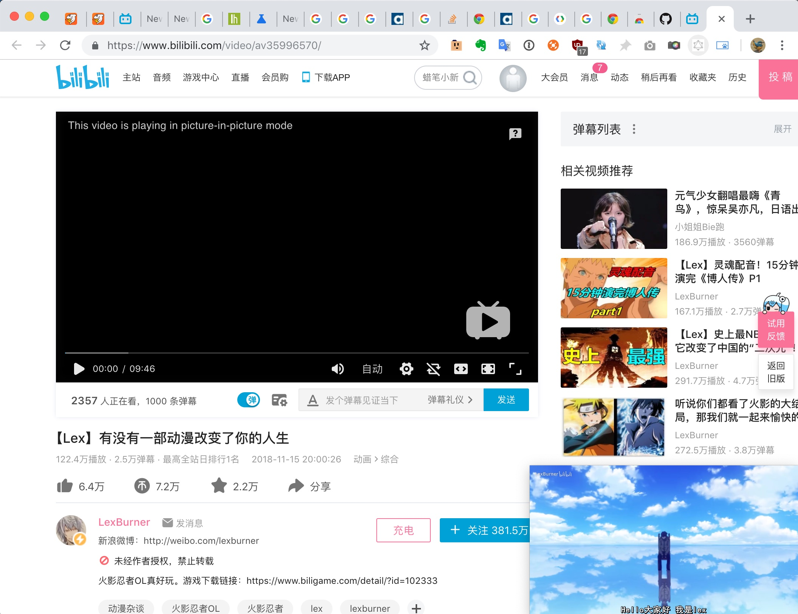

# CIP

CIP is short for **Cat In Picture**. It can let you trigger `Picture In Picture` window in chrome browser.

## How to use it

When you browser a page with a html5 player in it, and then click the extension icon. Then the video will be played in a isolate window.

## Screenshot

